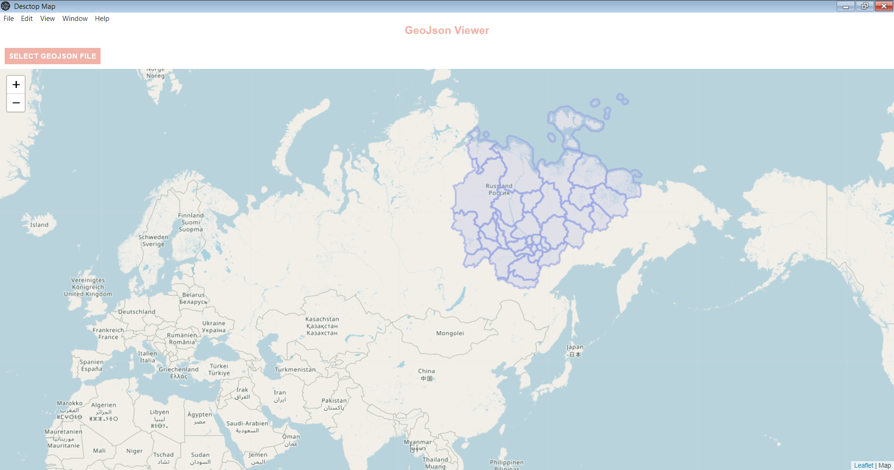

<!-- PROJECT LOGO -->
<h1 align="center">
  </a>
</h1>
<p align="center">
  <h3 align="center">Electron-GeoJsonViewer</h3>

  <p align="center">
    Win x64 Desktop Application
</p>


---
<!-- TABLE OF CONTENTS -->
<details open="open">
  <summary>Table of Contents</summary>
  <ol>
     <li>
      <a href="#built-with">Built With</a>
     </li>
    <li>
      <a href="#about-the-project">About The Project</a>
    </li>
    <li>
      <a href="#getting-started">Getting Started</a>
      <ul>
        <li><a href="#installation">Installation</a></li>
        <li><a href="#usage">Build</a></li>
      </ul>
    </li>
  </ol>
</details>

## Built With
* [Electron](https://www.electronjs.org) 
* [Leaflet](https://leafletjs.com) 
* [OSM](https://www.openstreetmap.org) 

<!-- ABOUT THE PROJECT -->
## About The Project
* Win x64 Desktop Application<br>
* Created for training purposes.<br>
* App features:<br>
  * OpenStreetMap Viewer<br>
  * Add GeoJson:<br>
<br><br>
  
<!-- GETTING STARTED -->
## Getting Started

### Installation

1. Clone the repo
   ```sh
   git clone https://github.com/EmelyanovKonstantin/Electron-GeoJsonViewer.git
   ```
2. Install NPM packages
   ```sh
   npm install
   ```
   
<!-- BUILD EXAMPLES -->
### Build
1. ```sh
   npm run package
   ```
   or
   ```sh
   npm run package -- --platform=<platform> arch=<architecture>
   ```
   or
   ```sh
   npm run make
   ```